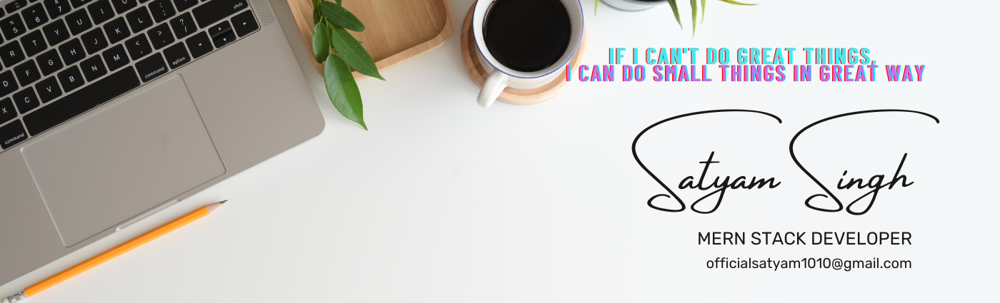
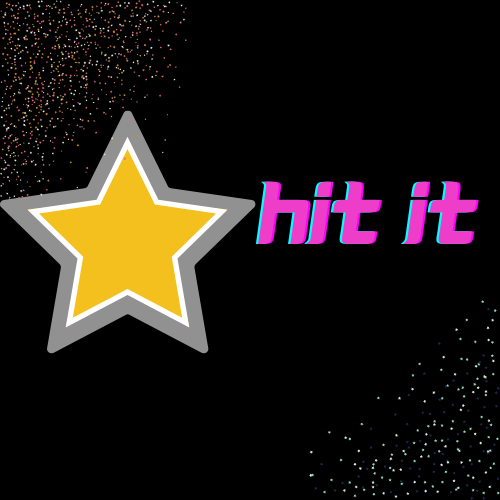

<h1 align="center">Hello I'm Satyam Singh</h1>

  
  

  

## 👨🏻‍💻 About Me:

-  🙋‍♂️ All about me is here in list

- 🔭 I’m currently working on `Something Intresting`.

- 🌱 I’m currently learning `MERN Stack`

- 👯 I’m looking to collaborate for `Dev Projects`

- 🤔 I’m looking for help with `Competitive Programming`

- 💬 Ask me about anything, Except Maths :sweat_smile:

- 👨‍💻 Life Hack: Learn new tech :fire: and share what you have learned :tada:

- ⚡ Fun fact: I waste most of my time playing with js code snippets

## 🛠️ Technologies and Tools I use:

 

 
 

## ❤️ Let's get connected:

</a>

## 🤝 Support Me:

## 📊 My GitHub Data:

  
  

